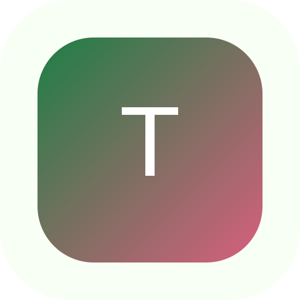

<div align="center">
  

# TeissIA

**L’analyse neurofruitée qui révèle votre véritable profil siropologique.**

[](./app.js)
[](./manifest.json)
[](#stack-technique)

[Découvrir](#présentation) · [Fonctionnalités](#fonctionnalités) · [Démarrer](#démarrage-rapide) · [Architecture](#architecture)

</div>

## Présentation

TeissIA est une mini-application web humoristique qui soumet l’utilisateur à huit questions scientifiquement discutables, simule une analyse aromatique ultra-sérieuse, puis délivre un diagnostic aussi définitif qu’absurde.

Le projet est construit en HTML, CSS et JavaScript natifs. Il ne nécessite ni framework, ni dépendance, ni étape de compilation.

> [!NOTE]
> TeissIA est une œuvre parodique. Les questions, métriques et résultats affichés sont fictifs et n’ont aucune valeur scientifique.

## Fonctionnalités

- Quiz interactif de 8 questions avec progression visuelle.
- Faux pipeline d’analyse animé sur 10 secondes.
- Métriques dynamiques : indice IA, stabilité fruitée et risque houblonné.
- Écran de résultat avec vibration compatible, animation de bulles et relance immédiate.
- Partage natif via la Web Share API, avec copie dans le presse-papiers ou saisie manuelle en solution de repli.
- Interface responsive optimisée pour mobile, tablette et ordinateur.
- Installation en application autonome grâce au Web App Manifest.
- Aucun suivi, compte utilisateur, stockage distant ou collecte de données.

> [!WARNING]
> Le résultat final contient une formulation volontairement familière et provocatrice. Le projet est destiné à un usage humoristique entre adultes avertis.

## Démarrage rapide

### Ouvrir directement

Clonez le dépôt, puis ouvrez `index.html` dans un navigateur moderne :

```bash
git clone https://github.com/christolosier-ship-it/TeissAI.git
cd TeissAI
```

### Lancer avec un serveur local

Un serveur HTTP local est recommandé pour tester correctement le manifest et les API du navigateur :

```bash
python3 -m http.server 8080
```

Ouvrez ensuite `http://localhost:8080`.

> [!TIP]
> Les fonctions de partage, de presse-papiers et d’installation peuvent varier selon le navigateur et nécessitent généralement un contexte sécurisé HTTPS en dehors de `localhost`.

## Installer l’application

### iPhone et iPad

1. Ouvrez l’application dans Safari.
2. Touchez **Partager**.
3. Choisissez **Sur l’écran d’accueil**.
4. Confirmez avec **Ajouter**.

### Android et ordinateur

Ouvrez l’application dans un navigateur compatible, puis utilisez l’option **Installer l’application** proposée dans la barre d’adresse ou dans le menu du navigateur.

> [!IMPORTANT]
> Le projet fournit un Web App Manifest, mais aucun service worker. L’application peut donc être installée en mode autonome, sans garantir un fonctionnement hors connexion.

## Architecture

```text
TeissAI/
├── index.html      # Structure des quatre écrans de l’application
├── style.css       # Design responsive, transitions et thèmes visuels
├── app.js          # Quiz, analyse simulée, partage et animation canvas
├── manifest.json   # Métadonnées d’installation de l’application web
├── icon.svg        # Icône principale et logo du projet
└── README.md       # Documentation du projet
```

Le parcours utilisateur suit une machine d’états légère pilotée côté client :

```text
Accueil → Quiz → Analyse simulée → Résultat
   ↑                                  │
   └──────────── Recommencer ─────────┘
```

Toutes les données du quiz restent en mémoire pendant la session et sont réinitialisées lors d’un nouveau test. Elles ne sont ni persistées ni transmises.

## Stack technique

| Élément | Utilisation |
| --- | --- |
| HTML5 | Structure sémantique et écrans de l’application |
| CSS3 | Responsive design, animations et prise en charge des safe areas |
| JavaScript | Navigation, quiz, métriques, partage et vibration |
| Canvas API | Animation décorative des bulles |
| Web Share API | Partage du résultat sur les plateformes compatibles |
| Web App Manifest | Installation en mode autonome |

## Personnalisation

Les principaux contenus peuvent être adaptés directement dans `app.js` :

- `questions` contient les questions et leurs réponses ;
- `analysisSubtexts` contient les messages affichés pendant l’analyse ;
- `shareText` définit le texte partagé.

Les couleurs et styles globaux sont centralisés dans les variables CSS déclarées au début de `style.css`.

## Déploiement sur GitHub Pages

1. Ouvrez **Settings** → **Pages** dans le dépôt GitHub.
2. Sélectionnez **Deploy from a branch**.
3. Choisissez la branche `main` et le dossier `/root`.
4. Enregistrez la configuration.

Le projet étant entièrement statique, aucune étape de build ni variable d’environnement n’est nécessaire.
